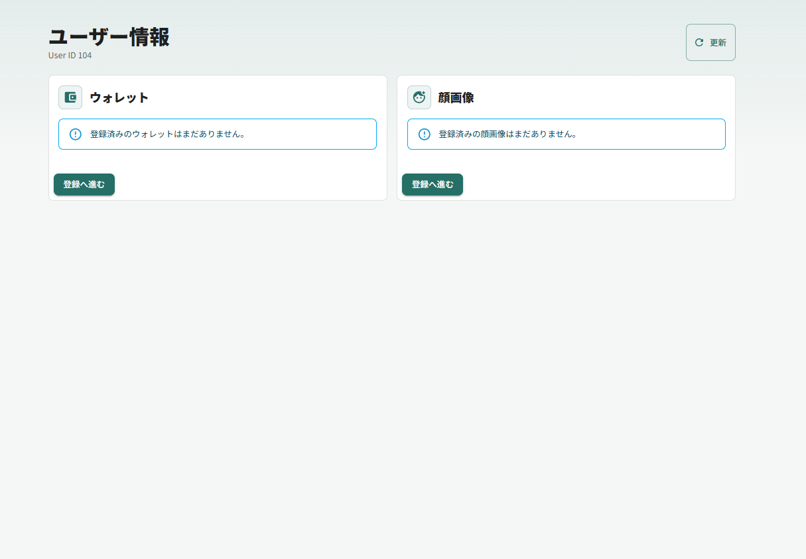
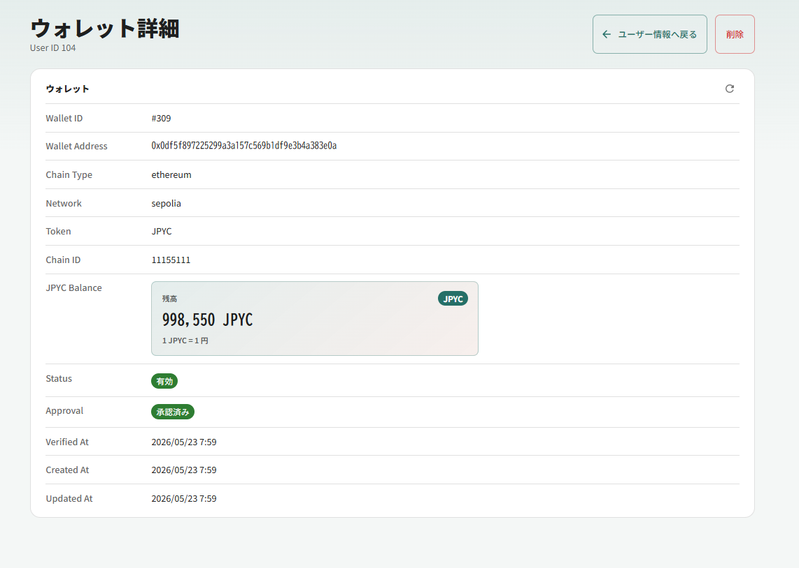
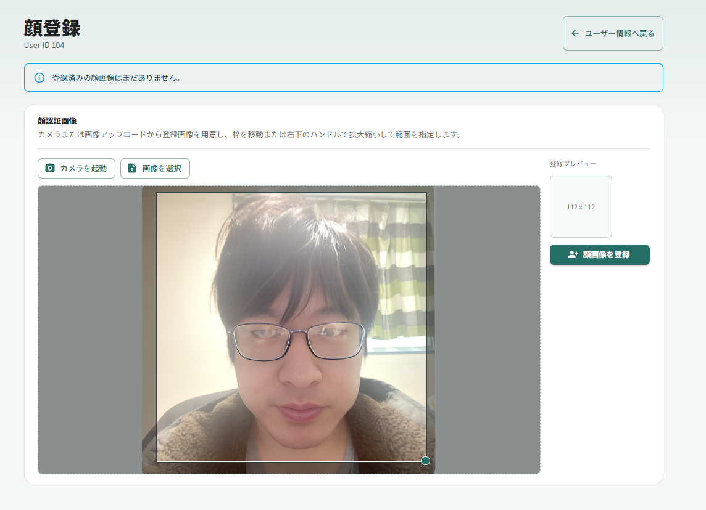

# teraid-pay-user

Teraid Pay のユーザー向けウォレット登録プロトタイプです。

ウォレット接続、署名によるウォレット登録、登録済みウォレットの表示、JPYC 残高表示、approve、削除を行います。API 側のプロトタイプ制約により、User ID は `104` に固定しています。

## 必要なもの

- Node.js
- Yarn
- ブラウザウォレット（MetaMask などの `window.ethereum` 対応ウォレット）
- Teraid Pay API

API 側のプロトタイプは以下のリポジトリにあります。

```text
https://github.com/terao06/teraid-pay-api
```

## セットアップ

依存関係をインストールします。

```bash
yarn install
```

開発用の環境変数ファイルを作成します。

```bash
copy .env.example .env.development
```

`.env.development` の値を必要に応じて変更してください。

## 環境変数

CRA ではブラウザ側に渡す環境変数名を `REACT_APP_` で始める必要があります。

```env
REACT_APP_TERAID_PAY_API=http://localhost:8005

REACT_APP_WALLET_CONNECT_PROJECT_ID=your_wallet_connect_project_id

REACT_APP_RPC_URL_ETHEREUM_MAINNET=https://ethereum-rpc.publicnode.com
REACT_APP_RPC_URL_ETHEREUM_SEPOLIA=https://ethereum-sepolia-rpc.publicnode.com
REACT_APP_RPC_URL_POLYGON_MAINNET=https://polygon-bor-rpc.publicnode.com
REACT_APP_RPC_URL_POLYGON_AMOY=https://polygon-amoy-bor-rpc.publicnode.com

REACT_APP_JPYC_TOKEN_ADDRESS_ETHEREUM_MAINNET=
REACT_APP_JPYC_TOKEN_ADDRESS_ETHEREUM_SEPOLIA=0xE7C3D8C9a439feDe00D2600032D5dB0Be71C3c29
REACT_APP_JPYC_TOKEN_ADDRESS_POLYGON_MAINNET=
REACT_APP_JPYC_TOKEN_ADDRESS_POLYGON_AMOY=
```

`REACT_APP_TERAID_PAY_API` は Pay API のベース URL です。未設定の場合はアプリ側で `http://localhost:8005` を使います。

`REACT_APP_WALLET_CONNECT_PROJECT_ID` は WalletConnect を使う場合の Project ID です。公式の WalletConnect Dashboard で作成します。

1. https://dashboard.walletconnect.com にアクセスします。
2. アカウントを作成、またはログインします。
3. Projects から新しいプロジェクトを作成します。
4. 作成された Project ID をコピーし、`.env.development` の `REACT_APP_WALLET_CONNECT_PROJECT_ID` に設定します。
5. Project ID はブラウザに公開される値なので、Dashboard 側で `localhost:3000` や本番ドメインを allowlist に設定してください。

現在の実装は CRA との互換性を優先して wagmi の `injected()` connector を使っています。そのため MetaMask などのブラウザ拡張ウォレット接続では Project ID は使用しません。WalletConnect QR / mobile wallet 接続を追加する場合に必要になります。

## 開発

開発サーバーを起動します。

```bash
yarn start
```

ブラウザで以下を開きます。

```text
http://localhost:3000
```

`.env.development` を変更した場合は、開発サーバーを再起動してください。

## ビルド

本番ビルドを作成します。

```bash
yarn build
```

CRA と wagmi の依存関係により、ビルド時に `@metamask/sdk` の optional import に関する警告が出る場合があります。現在の実装は RainbowKit / Metamask SDK 経由ではなく wagmi の `injected()` connector を使うため、アプリの実行経路ではこの警告対象を直接使用していません。

## ウォレット登録フロー

1. 起動時に `GET /user/104/wallet` で登録済みウォレットを取得します。
2. 未登録の場合、登録ボタンからウォレットを接続します。
3. ネットワークを選択します。
4. `POST /user/104/wallet/nonce` で nonce を発行します。
5. 接続ウォレットで nonce に署名します。
6. `POST /user/104/wallet` へ署名とネットワーク情報を送信して登録します。
7. 登録済みウォレットでは JPYC 残高確認、approve、削除ができます。

## 補足

- User ID は API 側のプロトタイプに合わせて `104` 固定です。
- `.env.development` は開発者ごとのローカル設定として扱います。
- `.env.example` は共有用テンプレートです。

## 画面サンプル
### 初期画面


### ウォレット詳細画面

※ 詳細画面承認ボタンより署名後ウォレット利用が可能なステータスになります。

### 顔登録画面
  
